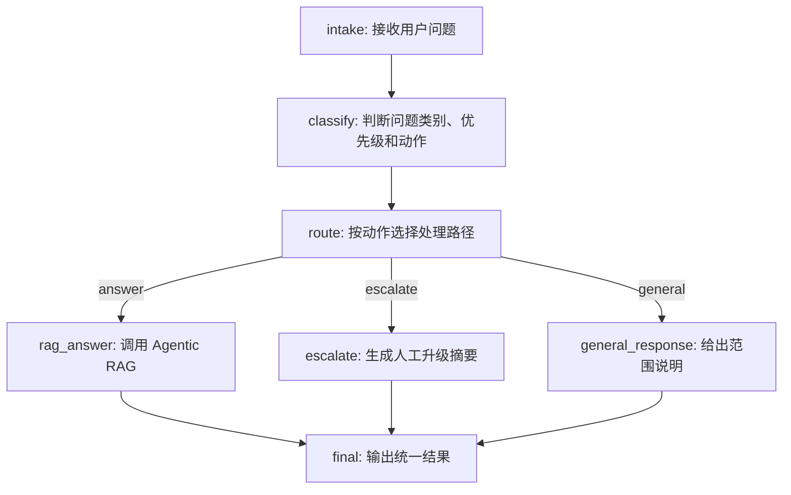

# Support Copilot

Support Copilot 是一个后端 API 作品项目，只展示两个核心能力：

1. Agentic RAG Agent：基于真实客服知识库检索、评分、引用来源并回答；无证据时明确说明知识库未覆盖。
2. LangGraph Triage Agent：用固定状态图完成客服问题分诊，并在知识库类问题上调用 RAG Agent。

项目不包含前端、登录、会话轮询、Celery 或 Redis。重点是 Agent 工作流、RAG grounding、评估和 Docker 可运行性。

## Architecture



节点说明：

- `intake`：接收用户输入，并记录图执行轨迹。
- `classify`：使用 LangChain 分类链判断 `category`、`priority`、`action` 和 `reason`。
- `route`：根据 `action` 把问题路由到 RAG、人工升级或普通回复。
- `rag_answer`：调用 Agentic RAG Agent，基于知识库生成带引用的答案。
- `escalate`：对投诉、安全、严重故障和明确人工诉求生成结构化升级回复。
- `general_response`：对寒暄或知识库范围外问题给出边界说明，不编造客服政策。
- `final`：统一输出 `category`、`priority`、`action`、`answer`、`citations` 和 `graph_trace`。

## Run

复制环境变量模板：

```powershell
Copy-Item .env.example .env
```

一键启动 API 和 Postgres/pgvector：

```powershell
docker compose up --build --remove-orphans
```

如果你使用已有数据库 volume，手动补跑一次初始化脚本：

```powershell
docker compose exec -T postgres psql -U support -d support_copilot -f /docker-entrypoint-initdb.d/001_init_pgvector.sql
```

健康检查：

```powershell
Invoke-RestMethod -Uri "http://127.0.0.1:8000/health"
```

导入内置客服知识库：

```powershell
Invoke-RestMethod -Method Post -Uri "http://127.0.0.1:8000/knowledge/ingest-demo"
```

调用 Agentic RAG：

```powershell
$body = @{ question = "API 一直返回 429 是什么意思？"; top_k = 5 } | ConvertTo-Json
Invoke-RestMethod -Method Post -Uri "http://127.0.0.1:8000/agents/rag/query" -ContentType "application/json" -Body $body
```

调用 LangGraph 分诊 Agent：

```powershell
$body = @{ message = "我忘记密码了，应该怎么重置？" } | ConvertTo-Json
Invoke-RestMethod -Method Post -Uri "http://127.0.0.1:8000/agents/triage/invoke" -ContentType "application/json" -Body $body
```

查看分诊图：

```powershell
Invoke-RestMethod -Uri "http://127.0.0.1:8000/agents/triage/graph"
```

## LLM Config

默认 `LLM_ENABLE_CALLS=false`，代码不会外呼大模型，会走本地 fallback，便于无密钥演示。

接 OpenAI-compatible 模型时，只改 `.env`：

```text
LLM_PROVIDER=qwen
LLM_CHAT_MODEL=qwen3.5-flash
LLM_API_KEY=你的 API Key
LLM_BASE_URL=https://dashscope.aliyuncs.com/compatible-mode/v1
LLM_ENABLE_CALLS=true
```

也可以改成 OpenAI 或 Ollama 的 OpenAI-compatible 地址。不要把真实密钥提交到代码或日志。

## RAGAS Evaluation

轻量离线评估使用 RAGAS。脚本会先导入内置知识库，再调用 LangGraph 分诊 Agent 收集 RAG 样本，最后用 RAGAS 输出：

- `context_precision`
- `context_recall`
- `faithfulness`
- `factual_correctness`
- 跳过的非 RAG 样本
- 平均 Agent 延迟

RAGAS 评估需要评审模型，请先在 `.env` 中打开真实模型调用：

```text
LLM_ENABLE_CALLS=true
LLM_API_KEY=你的 API Key
LLM_BASE_URL=https://dashscope.aliyuncs.com/compatible-mode/v1
LLM_CHAT_MODEL=qwen3.5-flash
RAGAS_DO_NOT_TRACK=true
```

运行评估：

```powershell
python backend\eval\run_eval.py
```

非 RAG 样本，例如人工升级和普通寒暄，会从 RAGAS 数据集中跳过，因为这些不适合用 RAG 指标评分。

## Portfolio Summary

简历可以这样写：

```text
Built a backend-only Support Copilot with an Agentic RAG agent and a LangGraph triage agent. The system uses FastAPI, LangChain, LangGraph, PostgreSQL/pgvector, Docker, and RAGAS; it supports grounded answers with citations, no-answer handling, human escalation, graph trace output, and RAGAS evaluation for context precision, context recall, faithfulness, and factual correctness.
```
