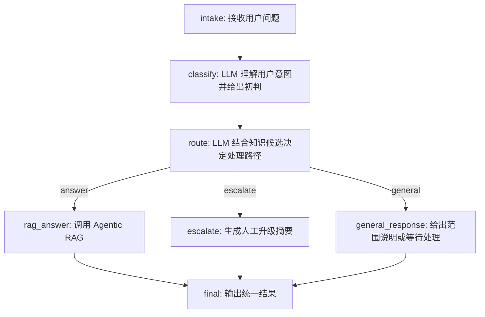

# Support Copilot

Support Copilot 是一个后端客服 Agent 原型项目，用来展示两个核心工作流：

- Agentic RAG Agent：从客服知识库检索相关内容，过滤低相关度结果，返回带引用来源的回答；当知识库没有覆盖问题时，会明确拒绝猜测。
- LangGraph Triage Agent：对客服请求做分类和分诊，并把问题路由到 RAG 回答、人工升级或普通范围说明。

项目刻意聚焦后端 Agent 能力，不包含前端页面、用户登录、后台任务队列、Celery 或 Redis。


## 功能亮点

- 基于 FastAPI 的后端 API，包含类型化请求和响应模型
- 使用 PostgreSQL + pgvector 存储和检索客服知识库
- 支持在无 LLM 时启动服务；此时 LangGraph 分诊 Agent 会明确返回“LLM 不可用，等待处理”
- 支持 OpenAI-compatible 模型配置，用于真实模型调用
- LangGraph 分诊流程会返回图执行轨迹，方便观察路由路径
- RAG 无相关证据时会返回 no-answer，不编造客服政策
- 内置 RAGAS 评估脚本，用于检查 RAG 回答质量
- 提供 Docker Compose，一键启动 API 和 pgvector 数据库

## 架构

### LangGraph 分诊流程图

下图对应 `LangGraphTriageAgent` 的实际路由流程：先接收用户问题，再由 LLM 理解用户意图、结合知识库候选决定进入知识库回答、人工升级或普通说明，最后统一输出结果。



## 技术栈

- Python
- FastAPI
- LangChain
- LangGraph
- PostgreSQL
- pgvector
- RAGAS
- Docker Compose
- pytest

## 项目结构

```text
.
|-- backend/
|   |-- app/
|   |   |-- agent/              # Agentic RAG 和 LangGraph 分诊 Agent
|   |   |-- data/               # 内置 demo 客服知识库
|   |   |-- config.py           # 环境变量配置
|   |   |-- llm_router.py       # LLM 路由与 RAG 答案生成
|   |   |-- main.py             # FastAPI 应用入口
|   |   |-- models.py           # 内部数据模型
|   |   |-- postgres_store.py   # pgvector 与内存知识库实现
|   |   `-- schemas.py          # API 请求和响应 schema
|   |-- eval/                   # RAGAS 评估用例和运行脚本
|   |-- tests/                  # Agent 行为测试
|   |-- Dockerfile
|   `-- requirements.txt
|-- db/
|   `-- 001_init_pgvector.sql   # 数据库表结构和向量索引
|-- docker-compose.yml
`-- README.md
```

## 快速开始

复制环境变量模板：

```powershell
Copy-Item .env.example .env
```

启动 API 和数据库：

```powershell
docker compose up --build --remove-orphans
```

服务启动后可以访问：

- `http://127.0.0.1:8000`
- Swagger UI：`http://127.0.0.1:8000/docs`

健康检查：

```powershell
Invoke-RestMethod -Uri "http://127.0.0.1:8000/health"
```

导入内置客服知识库：

```powershell
Invoke-RestMethod -Method Post -Uri "http://127.0.0.1:8000/knowledge/ingest-demo"
```

## API 示例

调用 Agentic RAG Agent：

```powershell
$body = @{
  question = "API 一直返回 429 是什么意思？"
  top_k = 5
} | ConvertTo-Json

Invoke-RestMethod `
  -Method Post `
  -Uri "http://127.0.0.1:8000/agents/rag/query" `
  -ContentType "application/json" `
  -Body $body
```

调用 LangGraph Triage Agent：

```powershell
$body = @{
  message = "API 一直返回 429，我应该怎么处理？"
} | ConvertTo-Json

Invoke-RestMethod `
  -Method Post `
  -Uri "http://127.0.0.1:8000/agents/triage/invoke" `
  -ContentType "application/json" `
  -Body $body
```

查看分诊图元数据：

```powershell
Invoke-RestMethod -Uri "http://127.0.0.1:8000/agents/triage/graph"
```

## LLM 配置

`.env.example` 默认设置为 `LLM_ENABLE_CALLS=false`。在这个模式下，项目不会调用外部模型，因此没有 API Key 也可以启动服务并演示健康检查、知识库导入和直接 RAG 查询；但 LangGraph 分诊 Agent 不会退回本地规则，而是明确返回“当前 LLM 不可用，请稍后重试或等待人工处理”。

如果要接入 OpenAI-compatible 模型，可以修改 `.env`：

```text
LLM_PROVIDER=qwen
LLM_CHAT_MODEL=qwen3.5-flash
LLM_API_KEY=your-api-key
LLM_BASE_URL=https://dashscope.aliyuncs.com/compatible-mode/v1
LLM_ENABLE_CALLS=true
```

不要提交真实 API Key。真实密钥应只放在本地 `.env` 中，`.env` 已经被 Git 忽略。

## 评估

RAGAS 评估脚本会导入 demo 知识库，调用分诊 Agent 跑评估用例，跳过非 RAG 类型用例，并输出 RAG 指标。

RAGAS 评估需要真实评审模型。运行前先配置 `.env`：

```text
LLM_ENABLE_CALLS=true
LLM_API_KEY=your-api-key
LLM_BASE_URL=https://dashscope.aliyuncs.com/compatible-mode/v1
LLM_CHAT_MODEL=qwen3.5-flash
RAGAS_DO_NOT_TRACK=true
```

运行评估：

```powershell
python backend\eval\run_eval.py
```

评估报告包括：

- context precision
- context recall
- faithfulness
- factual correctness
- 跳过的非 RAG 用例
- 平均 Agent 延迟

## 测试

安装依赖并运行后端测试：

```powershell
pip install -r backend\requirements.txt
pytest backend
```

当前测试覆盖 RAG 命中引用、无答案处理、知识库问题路由和人工升级路由。


## 演示效果

### 功能图片效果


### 视频演示效果
【Support Copilot演示】 https://www.bilibili.com/video/BV1EAQgBXEvm/?share_source=copy_web&vd_source=912f8836f6e7d0e13807d6f5c7c58998


