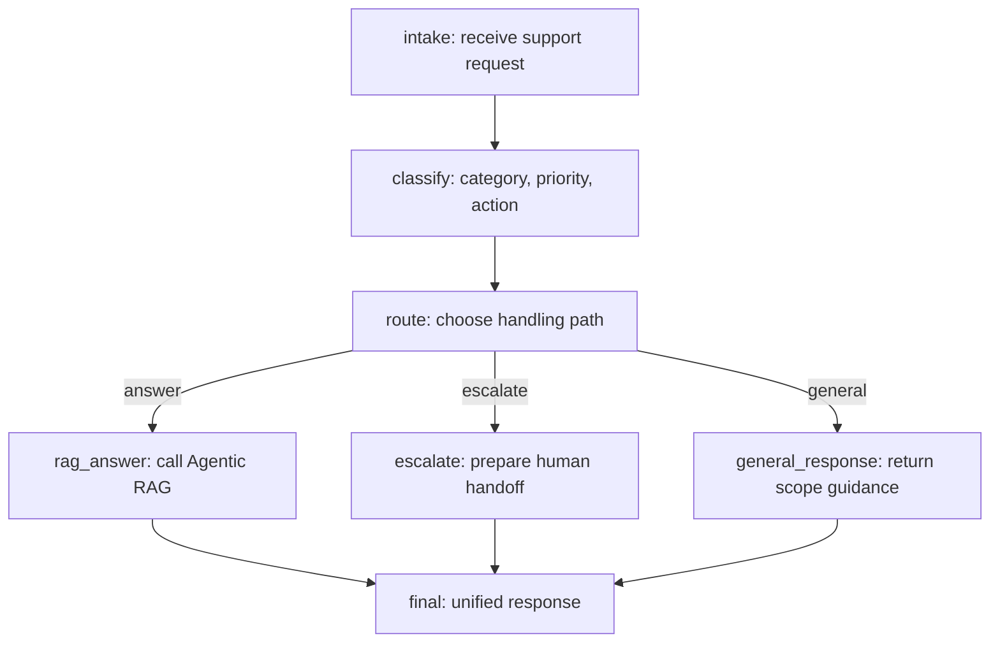

# Support Copilot

Support Copilot is a backend-only support automation prototype that demonstrates two agent workflows:

- An Agentic RAG agent that retrieves support knowledge, filters low-confidence matches, returns grounded answers with citations, and refuses to guess when the knowledge base does not cover the question.
- A LangGraph triage agent that classifies support requests and routes them to a RAG answer, human escalation, or a general scope response.

The project is intentionally focused on backend agent behavior. It does not include a frontend, user login, background workers, Celery, or Redis.

## Features

- FastAPI service with typed request and response models
- PostgreSQL with pgvector for support knowledge storage and vector retrieval
- Deterministic local fallback mode for demos without external LLM calls
- OpenAI-compatible LLM configuration for real model calls
- LangGraph workflow trace output for triage decisions
- No-answer handling when retrieved context is not relevant enough
- RAGAS evaluation script for RAG quality checks
- Docker Compose setup for the API and pgvector database

## Architecture



## Tech Stack

- Python
- FastAPI
- LangChain
- LangGraph
- PostgreSQL
- pgvector
- RAGAS
- Docker Compose
- pytest

## Project Layout

```text
.
|-- backend/
|   |-- app/
|   |   |-- agent/              # Agentic RAG and LangGraph triage agents
|   |   |-- data/               # Built-in demo support knowledge
|   |   |-- config.py           # Environment-based settings
|   |   |-- llm_router.py       # LLM and fallback routing
|   |   |-- main.py             # FastAPI application
|   |   |-- models.py           # Internal data models
|   |   |-- postgres_store.py   # pgvector and in-memory knowledge stores
|   |   `-- schemas.py          # API request and response schemas
|   |-- eval/                   # RAGAS evaluation cases and runner
|   |-- tests/                  # Agent behavior tests
|   |-- Dockerfile
|   `-- requirements.txt
|-- db/
|   `-- 001_init_pgvector.sql   # Database schema and vector index setup
|-- docs/
|   |-- MODULES.md
|   `-- RUNBOOK.md
|-- docker-compose.yml
`-- README.md
```

## Quick Start

Copy the environment template:

```powershell
Copy-Item .env.example .env
```

Start the API and database:

```powershell
docker compose up --build --remove-orphans
```

The API will be available at:

- `http://127.0.0.1:8000`
- Swagger UI: `http://127.0.0.1:8000/docs`

Check service health:

```powershell
Invoke-RestMethod -Uri "http://127.0.0.1:8000/health"
```

Load the built-in support knowledge base:

```powershell
Invoke-RestMethod -Method Post -Uri "http://127.0.0.1:8000/knowledge/ingest-demo"
```

## API Examples

Query the Agentic RAG agent:

```powershell
$body = @{
  question = "What does an API 429 response mean?"
  top_k = 5
} | ConvertTo-Json

Invoke-RestMethod `
  -Method Post `
  -Uri "http://127.0.0.1:8000/agents/rag/query" `
  -ContentType "application/json" `
  -Body $body
```

Invoke the LangGraph triage agent:

```powershell
$body = @{
  message = "API keeps returning 429. What should I do?"
} | ConvertTo-Json

Invoke-RestMethod `
  -Method Post `
  -Uri "http://127.0.0.1:8000/agents/triage/invoke" `
  -ContentType "application/json" `
  -Body $body
```

Read the triage graph metadata:

```powershell
Invoke-RestMethod -Uri "http://127.0.0.1:8000/agents/triage/graph"
```

## LLM Configuration

By default, `.env.example` sets `LLM_ENABLE_CALLS=false`. In that mode, the project uses local fallback behavior and does not call an external model, which keeps the demo runnable without an API key.

To use an OpenAI-compatible provider, update `.env`:

```text
LLM_PROVIDER=qwen
LLM_CHAT_MODEL=qwen3.5-flash
LLM_API_KEY=your-api-key
LLM_BASE_URL=https://dashscope.aliyuncs.com/compatible-mode/v1
LLM_ENABLE_CALLS=true
```

Do not commit real API keys. Keep local secrets in `.env`, which is ignored by Git.

## Evaluation

The RAGAS runner imports the demo knowledge base, invokes the triage agent on evaluation cases, skips non-RAG cases, and reports RAG metrics.

RAGAS evaluation requires a real evaluator model. Configure `.env` first:

```text
LLM_ENABLE_CALLS=true
LLM_API_KEY=your-api-key
LLM_BASE_URL=https://dashscope.aliyuncs.com/compatible-mode/v1
LLM_CHAT_MODEL=qwen3.5-flash
RAGAS_DO_NOT_TRACK=true
```

Run:

```powershell
python backend\eval\run_eval.py
```

The report includes:

- context precision
- context recall
- faithfulness
- factual correctness
- skipped non-RAG cases
- average agent latency

## Tests

Install dependencies and run the backend tests:

```powershell
pip install -r backend\requirements.txt
pytest backend
```

The current tests cover RAG citation behavior, no-answer behavior, knowledge question routing, and human escalation routing.

## Notes

- `.env`, `.venv/`, cache directories, build artifacts, and logs are excluded from Git.
- Existing database volumes may need the initialization script re-run if the schema changed:

```powershell
docker compose exec -T postgres psql -U support -d support_copilot -f /docker-entrypoint-initdb.d/001_init_pgvector.sql
```
